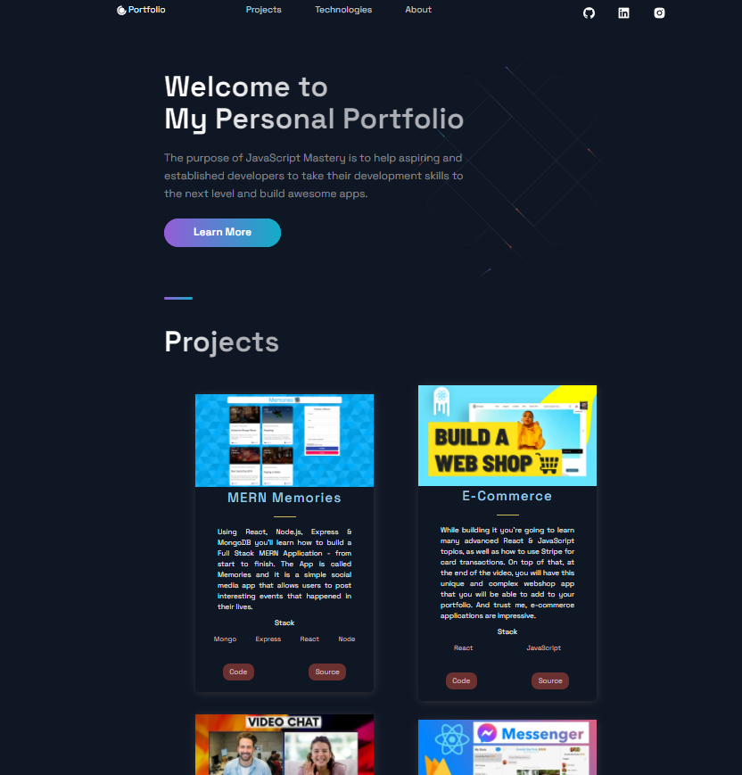
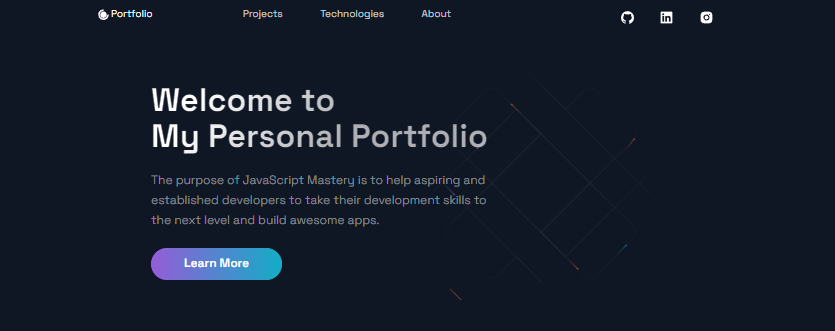
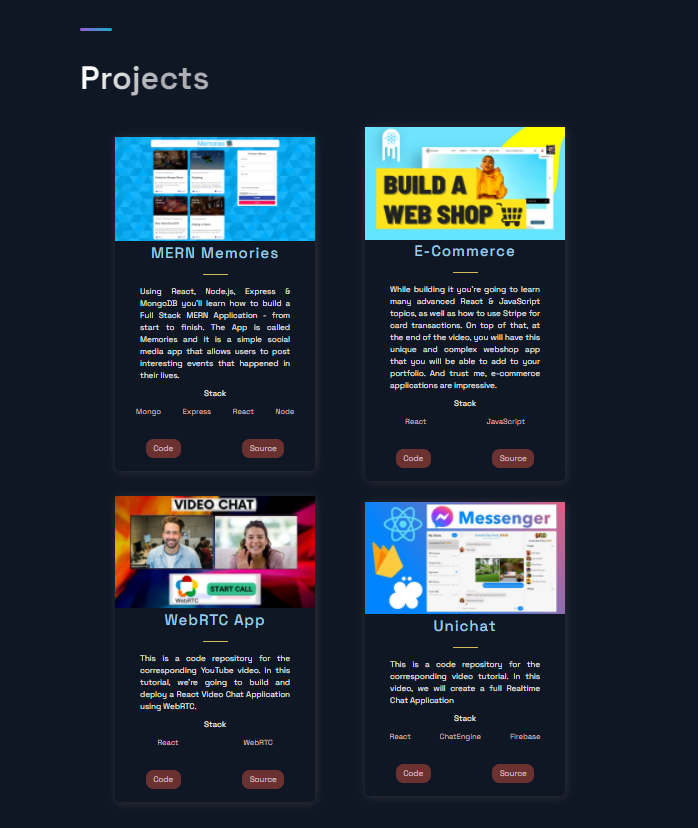
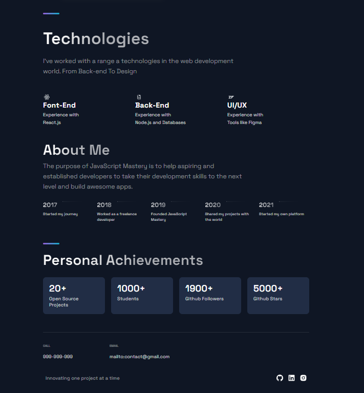
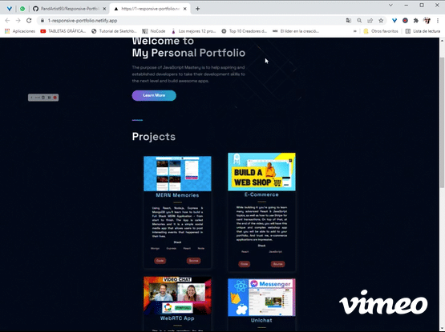
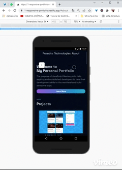

## Portfolio

💻 Portfolio created based on a design tutorial. For the purpose of practicing next.js and other topics. 📑 ✏

If you want to view the portfolio, you can do it through the following link 🌐[Portfolio Website](https://1-responsive-portfolio.netlify.app/)

***

<h3>Main view</h3>

    

<h3>Sections</h3>

    

<h3>Sections Projects</h3>

    

<h3>Sections technologies and About Me</h3>

    

    
Desktop view

    

    
Movile view

    

****

Design by javascriptmastery, resources at [here](https://www.completepathtojavascriptmastery.com/) and on respective social networks.

